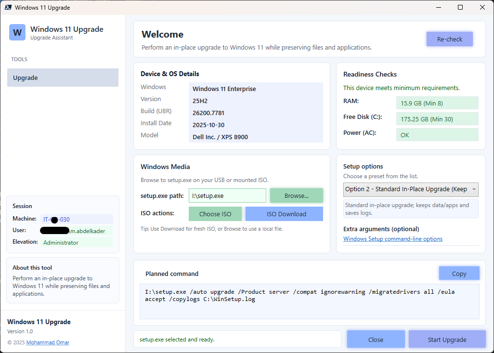

# 🪟 Windows 11 Upgrade Assistant


[](https://www.buymeacoffee.com/mabdulkadrx)
---

## 📖 Overview

**Windows 11 Upgrade Assistant** is a modern **WPF-based PowerShell** tool that helps IT teams run a controlled **in-place upgrade to Windows 11** while preserving **apps, files, and settings**.

It provides a clean workflow to:

- Run quick **readiness checks** (RAM, Disk, AC power)
- Validate **Windows setup media** by selecting `setup.exe` (USB / mounted ISO)
- Mount an ISO and auto-detect `setup.exe`
- Choose from safe **Setup Profiles** (preset command templates)
- Preview the exact **Planned command** before execution
- Launch Windows Setup with clear status feedback

---

## 🖥 Screenshot



---

## ✨ Core Features

### 🔹 Welcome + Re-check
- One-click **Re-check** to refresh device info and readiness.

### 🔹 Device & OS Details
Displays:
- Windows Edition
- Version
- Build (UBR)
- Install Date
- Hardware model (Manufacturer / Model)

### 🔹 Readiness Checks
Visual checks with pass/fail pills:
- **RAM** (Min 8 GB by default)
- **Free Disk (C:)** (Min 30 GB by default)
- **Power (AC)** (best-effort; desktops treated as OK)

### 🔹 Windows Media Validation
- Browse to a valid `setup.exe`
- Enforces filename validation (`setup.exe` only)
- Highlights the field green when valid

### 🔹 ISO Actions
- **Choose ISO** → mounts the ISO and automatically sets `setup.exe` path
- **Download ISO** → opens organization download page (configured to QU portal)

### 🔹 Setup Profiles (Preset Arguments)
Selectable upgrade templates stored in the script:

- **Option 1 – Basic**
  - Clean-style flow with driver migration
- **Option 2 – Standard In-Place Upgrade (Default)**
  - Keeps data/apps + writes logs to `C:\WinSetup.log`
- **Option 3 – Silent In-Place Upgrade**
  - Quiet mode, no OOBE, no reboot (depends on media/policy)

### 🔹 Planned Command Preview
- Shows the exact command that will run:
```

<setup.exe path> <selected args> <extra args>

```

### 🔹 Extra Arguments (Optional)
- Add custom Windows Setup switches
- Includes an official docs link for reference

### 🔹 Safe Launch Behavior
- If not running elevated, the tool offers a choice to run setup **as Administrator**
- Clear status messages for common failures (missing file, blocked execution, access denied)

---

## 📂 Data / Folder Structure

This tool does not require a fixed working folder, but recommended structure for packaging:

```

Windows-11-Upgrade-Assistant
├── Windows-11-Upgrade-Assistant-v1.0.ps1
├── Windows-11-Upgrade-Assistant-v1.0.exe
├── README.md
└── Screenshot.png

```

Log output (by setup profile default) typically writes to:

```

C:\WinSetup.log

````

---

## ⚙️ Requirements

### System
- Windows 10 / 11
- Windows PowerShell 5.1
- ISO mounting supported (Windows built-in)

### Permissions
- Standard user can open the UI and browse media
- **Administrator** recommended for launching `setup.exe` reliably

---

## 🚀 How to Run

### Option 1 — PowerShell Script
```powershell
Set-ExecutionPolicy Bypass -Scope Process -Force
.\Windows-11-Upgrade-Assistant-v1.0.ps1
````

### Option 2 — Packaged EXE

Run:

```
Windows-11-Upgrade-Assistant-v1.0.exe
```

---

## 🔧 Typical Workflow

1. Launch the tool
2. Review **Device & OS Details** + **Readiness Checks**
3. Click **Browse** and select `setup.exe` from:

   * Mounted ISO, or
   * USB Windows installation media
4. (Optional) Choose ISO → auto-mount and fill the `setup.exe` path
5. Select the desired **Setup option** preset
6. (Optional) add **Extra arguments**
7. Verify the **Planned command**
8. Click **Start Upgrade**

---

## 🛡 Operational Notes

* Presets may include switches like `/Product server` and `/compat IgnoreWarning`.
* Use relaxed compatibility options only if approved by organizational policy.
* Always test on pilot devices before broad rollout.
* Ensure your Windows media matches target language/edition requirements.

---

## 📜 License

This project is licensed under the [MIT License](https://opensource.org/licenses/MIT).

---

## 👤 Author

* **Mohammad Abdelkader**
* Website: **momar.tech**
* Version: **1.0**
* Date: **2026-02-25**

---

## ☕ Donate

If you find this project helpful, consider supporting it by  
[buying me a coffee](https://www.buymeacoffee.com/mabdulkadrx).

---

## ⚠ Disclaimer

This tool is provided **as-is**.

* Test in staging before production
* Ensure correct Graph permissions
* Validate organizational compliance before deployment


