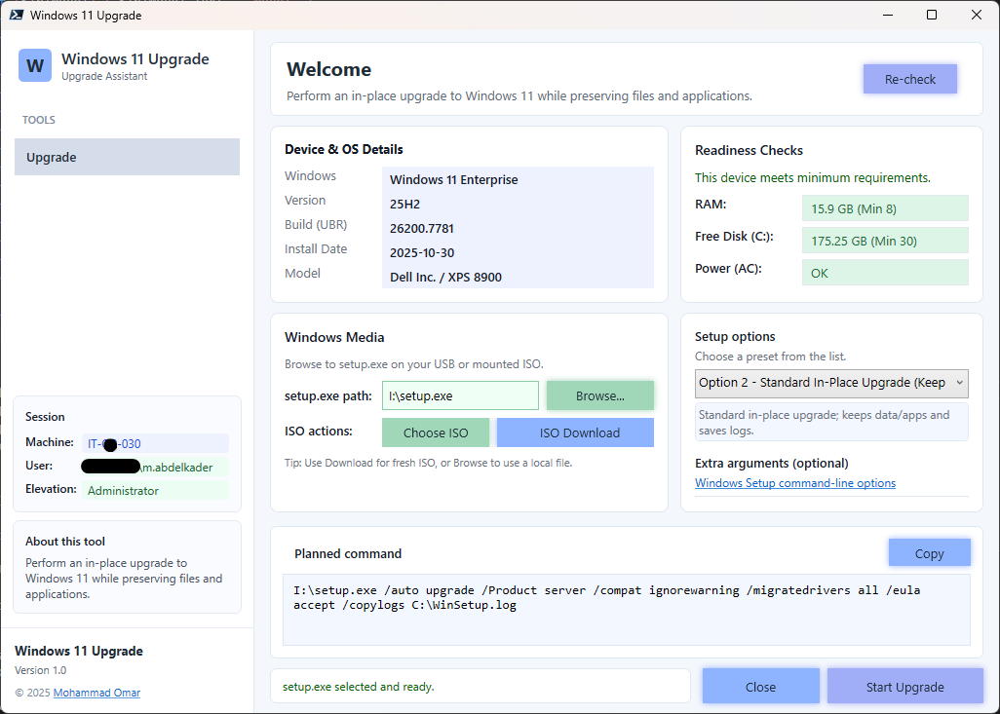

# 🪟 Windows 11 Upgrade Assistant


[](https://www.buymeacoffee.com/mabdulkadrx)
---

## 📖 Overview

**Windows 11 Upgrade Assistant** is a modern WPF-based PowerShell tool that helps any user run a controlled in-place upgrade to Windows 11 while preserving apps, files, and settings — and it can remove the restrictions that block installing Windows 11 on unsupported hardware. Old PC? No TPM, no Secure Boot, unsupported CPU? It lets you install Windows 11 anyway.

It provides a clean workflow to:

- Run quick **readiness checks** (RAM, Disk, AC power)
- Validate **Windows setup media** by selecting `setup.exe` (USB / mounted ISO)
- Mount an ISO and auto-detect `setup.exe`
- Choose from safe **Setup Profiles** (preset command templates)
- Preview the exact **Planned command** before execution
- **Confirm and audit** the full setup.exe command in a dedicated dialog before launch
- Launch Windows Setup with clear status feedback
- Auto-dismount the ISO and clean up on window close
- **Session transcript logging** to `%LOCALAPPDATA%\Win11UpgradeAssistant\Logs\`

---

## 🖥 Screenshot



---

## ✨ Core Features

### 🔹 Welcome + Re-check
- One-click **Re-check** to refresh device info and readiness.
- The background device-info scan runs on a dedicated MTA runspace, so the UI never freezes on slow WMI queries.

### 🔹 Device & OS Details
Displays:
- Windows Edition (with build-aware normalisation for build 22000+ devices)
- Version
- Build (UBR)
- Install Date
- Hardware model (Manufacturer / Model)

### 🔹 Readiness Checks
Visual checks with pass/fail pills:
- **RAM** (Min 8 GB by default)
- **Free Disk (C:)** (Min 30 GB by default)
- **Power (AC)** (best-effort; desktops treated as OK)

### 🔹 Windows Media Validation
- **Browse** to a valid `setup.exe`
- **Clear** to reset the current path
- Enforces filename validation (`setup.exe` only)
- Highlights the field green when valid

### 🔹 ISO Actions
- **Choose ISO** → mounts the ISO and automatically sets `setup.exe` path
- **Unmount ISO** *(new in v1.1)* → releases the mounted image after the upgrade, freeing the drive letter
- **Download ISO** → opens the official Microsoft Windows 11 download page

### 🔹 Setup Profiles (Preset Arguments)
Selectable upgrade templates stored in the script:

- **Option 1 – Basic**
  - Clean-style flow with driver migration
- **Option 2 – Standard In-Place Upgrade (Default)**
  - Keeps data/apps + writes logs to `C:\WinSetup.log`
- **Option 3 – Silent In-Place Upgrade**
  - Quiet mode, no OOBE, no reboot (depends on media/policy)

### 🔹 Planned Command Preview
- Shows the exact command that will run:
```

<setup.exe path> <selected args> <extra args>
```

### 🔹 Extra Arguments (Optional)
- Add custom Windows Setup switches
- Includes an official docs link for reference

### 🔹 Confirm Before Launch *(new in v1.1)*
- A dedicated modal dialog displays the **full setup.exe command** before execution.
- Three options:
  - **Launch** — proceeds to start Windows Setup
  - **Copy** — copies the command to the clipboard without launching (useful for auditing)
  - **Cancel** — aborts
- The dialog auto-sizes to the message length and scrolls for unusually long commands.

### 🔹 Safe Launch Behavior
- If not running elevated, the tool offers a choice to run setup **as Administrator** (Yes / Continue / Cancel)
- Clear status messages for common failures (missing file, blocked execution, access denied, UAC cancelled, AppLocker/Defender block)
- Elevated and non-elevated sessions are clearly shown in the sidebar

### 🔹 Session Logging *(new in v1.1)*
- Every run captures a `Start-Transcript` log to:
```
%LOCALAPPDATA%\Win11UpgradeAssistant\Logs\Session_yyyyMMdd_HHmmss.log
```
- The transcript is closed cleanly when the window is closed.
- ISO is automatically dismounted on exit so the drive letter is released even if the operator forgets.

---

## 🆕 What's New in v1.1

| Type | Change |
|------|--------|
| ✨ Added | **Unmount ISO** button (release the mounted image without leaving the UI) |
| ✨ Added | **Clear** button for the setup.exe path |
| ✨ Added | **Session transcript logging** to `%LOCALAPPDATA%\Win11UpgradeAssistant\Logs\` |
| ✨ Added | **Confirm dialog** before launching setup.exe, with the full command displayed |
| ✨ Added | **Copy** option in the confirm dialog (copy without launching) |
| ✨ Added | **Auto-dismount ISO** on window close (silent, no error if nothing is mounted) |
| 🐛 Fixed | **Null-reference bug** on `tRam` / `tFree` controls (controls referenced in code but absent from XAML) |
| 🐛 Fixed | **UI stutter** caused by `Update-DeviceUI` being invoked on every keystroke in the setup-path textbox |
| 🐛 Fixed | **Product-name normalisation** in `Get-DeviceInfo` was one-sided — now also handles the inverse case (build < 22000 with a registry that says "Windows 11") |
| 🐛 Fixed | **Confirm dialog buttons invisible** when the message is long — dialog now uses `SizeToContent="Height"` with a `ScrollViewer` for the message area |
| 🛠 Refactored | `Get-DeviceInfo` is now defined once and injected into the background runspace by string (Invoke-Expression) — no more duplicated ~50 lines of code |
| 🛠 Refactored | All 27 functions now have PowerShell-style `.SYNOPSIS` / `.DESCRIPTION` doc comments |
| 🛠 Refactored | Inline XAML labels and tooltip text consolidated into a single `Apply-Lang` function for future localisation |

---

## 📂 Data / Folder Structure

This tool does not require a fixed working folder, but recommended structure for packaging:

```
Windows-11-Upgrade-Assistant
├── Windows-11-Upgrade-Assistant-v1.1.ps1
├── Windows-11-Upgrade-Assistant-v1.0.exe
├── Windows-11-Upgrade-Assistant-v1.0.backup.ps1   (v1.0 source kept for reference)
├── README.md
└── Screenshot.png
```

Log output (by setup profile default) typically writes to:
```
C:\WinSetup.log
```

Session transcript logs (new in v1.1) are written to:
```
%LOCALAPPDATA%\Win11UpgradeAssistant\Logs\Session_<timestamp>.log
```

---

## ⚙️ Requirements

### System
- Windows 10 / 11
- Windows PowerShell 5.1 (PowerShell 7+ also works)
- ISO mounting supported (Windows built-in)

### Permissions
- Standard user can open the UI and browse media
- **Administrator** recommended for launching `setup.exe` reliably
- The UI detects the elevation state and shows it in the sidebar

---

## 🚀 How to Run

### Option 1 — PowerShell Script
```powershell
Set-ExecutionPolicy Bypass -Scope Process -Force
.\Windows-11-Upgrade-Assistant-v1.1.ps1
```

### Option 2 — Packaged EXE

> ⚠ The bundled `.exe` was built from the v1.0 source. To ship an updated EXE, recompile the v1.1 script with PS2EXE or a similar tool:
>
> ```powershell
> Invoke-ps2exe -inputFile  ".\Windows-11-Upgrade-Assistant-v1.1.ps1" `
>               -outputFile ".\Windows-11-Upgrade-Assistant-v1.1.exe" `
>               -requireAdmin -noConsole
> ```

Run:
```
Windows-11-Upgrade-Assistant-v1.1.exe
```

---

## 🔧 Typical Workflow

1. Launch the tool
2. Review **Device & OS Details** + **Readiness Checks** in the right panel
3. Click **Browse** and select `setup.exe` from:
   * Mounted ISO, or
   * USB Windows installation media
4. (Optional) Click **Choose ISO** → auto-mount and fill the `setup.exe` path
5. (Optional) Click **Clear** to reset the path
6. Select the desired **Setup option** preset
7. (Optional) add **Extra arguments**
8. Verify the **Planned command** preview
9. Click **Start Upgrade**
10. A confirmation dialog appears — review the full command and choose:
    * **Launch** to run Windows Setup
    * **Copy** to copy the command to the clipboard without launching
    * **Cancel** to abort
11. (Optional) After the upgrade, click **Unmount ISO** to release the mounted image
12. Close the window — the ISO is auto-dismounted and the session log is finalised

---

## 🛡 Operational Notes

* Presets may include switches like `/Product server` and `/compat IgnoreWarning`.
* Use relaxed compatibility options only if approved by organizational policy.
* Always test on pilot devices before broad rollout.
* Ensure your Windows media matches target language/edition requirements.
* Session logs are written **unencrypted** to a per-user folder; do not include secrets in the Extra Arguments field.
* The background runspace runs as **MTA** — this is intentional, since WMI/CIM is faster on MTA and the UI thread is STA.

---

## 🐛 Troubleshooting

| Symptom | Likely Cause | Fix |
|---------|--------------|-----|
| "Checks failed" pill stays red | WMI service disabled or running without admin | Enable `Winmgmt` and re-run elevated |
| ISO mounts but no `setup.exe` path is filled | ISO is not a Windows installation media | Use a different ISO |
| "Access denied" on launch | Standard user without UAC bypass | Click **Run as admin** in the elevation prompt |
| Confirm dialog buttons invisible *(v1.0 only)* | Fixed in v1.1 — dialog was hard-coded to 240 px tall | Update to v1.1 |
| UI freezes when scanning | Fixed in v1.0.5+ via MTA runspace | Update to v1.1 |

---

## 📜 License

This project is licensed under the [MIT License](https://opensource.org/licenses/MIT).

---

## 👤 Author

**Mohammad Abdulkader Omar**  
Website: https://momar.tech  
LinkedIn: https://www.linkedin.com/in/mabdulkadr/  
Version: **1.1**

---

## ☕ Support

If this project helps you, consider supporting it:

[](https://www.buymeacoffee.com/mabdulkadrx)

---

## ⚠ Disclaimer

These scripts are provided as-is. Test them in a staging environment before applying them to production. The author is not responsible for any unintended outcomes resulting from their use.
